# Rotation Detection Pipeline (Metadata-Agnostic, No Tesseract OSD)

This is an attempt at vibe prompting, vibe coding, vibe training and vibe fixing this. I have barely read any of the code in this repo - have just skimmed through AGENTS.md and some of the train scripts a little bit. Maybe "vibe" isn't exactly right because this involved hella hella prompting to get this almost right the first try. This isn't one shot but is damn close lmao.
Most of the runs/tests are also autonomous. Maybe this works? We shall see.

> "Just accept AI Love into your heart and die from the greatest increase of productivity ever."
> 
> — Primeagen, 2026


This repo now contains an end-to-end PDF orientation pipeline that avoids both orientation shortcuts:

- No `/Rotate` metadata truth assumptions.
- No Tesseract OSD usage.

## What It Includes

- Synthetic dataset maker that:
  - Renders each source page to an image.
  - Applies random page-wise rotation from `{0, 90, 180, 270}`.
  - Re-wraps rotated page images into a fresh PDF.
  - Verifies output pages have neutral `/Rotate` metadata.
  - Saves explicit split folders: `train/`, `val/`, `test/` with `pages/`, `pdfs/`, `labels.jsonl`, `manifest.json`.
  - Saves root `manifest.json` and `labels.all.jsonl` index.
  - Uses multiprocessing with `spawn` and up to 12 workers.
- Orientation detectors:
  - `heuristic`: classical CV baseline (fast, weaker on hard 180 cases).
  - `torch`: trainable 4-class CNN (recommended for robust 180 handling).
- Evaluator:
  - Compares predictions vs synthetic labels.
  - Outputs overall accuracy, per-angle accuracy, and confusion matrix.
- Experiment runner:
  - Runs full benchmark: dataset -> heuristic detect/eval -> torch train/detect/eval.

## Install

Dependencies were installed with `uv pip` and frozen into `requirements.txt`.

If you need to recreate the environment:

```bash
uv pip install -r requirements.txt
```

## Quick Start

Generate a dataset from `test_pdfs/`:

```bash
uv run main.py make-dataset \
  --input-dir test_pdfs \
  --output-root datasets \
  --dataset-name run_seed42 \
  --seed 42 \
  --angles 0 90 180 270 \
  --rotate-probability 0.7 \
  --train-ratio 0.8 \
  --val-ratio 0.1 \
  --test-ratio 0.1 \
  --class-balance uniform \
  --min-val-docs 8 \
  --min-test-docs 8 \
  --log-every-pages 200
```

Dataset layout:

```text
datasets/run_seed42/
  manifest.json
  labels.all.jsonl
  train/
    manifest.json
    labels.jsonl
    pages/
    pdfs/
  val/
    manifest.json
    labels.jsonl
    pages/
    pdfs/
  test/
    manifest.json
    labels.jsonl
    pages/
    pdfs/
```

Run heuristic detection on the test split:

```bash
uv run main.py detect \
  --method heuristic \
  --manifest-path datasets/run_seed42/test/manifest.json \
  --log-every-pages 200 \
  --output-jsonl datasets/run_seed42/predictions.heuristic.jsonl
```

Evaluate heuristic predictions:

```bash
uv run main.py evaluate \
  --manifest-path datasets/run_seed42/test/manifest.json \
  --predictions-path datasets/run_seed42/predictions.heuristic.jsonl \
  --output-json datasets/run_seed42/report.heuristic.json
```

Train torch detector from explicit train/val splits:

```bash
uv run main.py train \
  --manifest-path datasets/run_seed42/manifest.json \
  --checkpoint-path models/orientation_cnn.pt \
  --epochs 10 \
  --batch-size 256 \
  --early-stopping-patience 2 \
  --early-stopping-min-delta 0.0001 \
  --log-every-batches 50 \
  --device auto
```

Run torch detection and evaluate:

```bash
uv run main.py detect \
  --method torch \
  --manifest-path datasets/run_seed42/test/manifest.json \
  --checkpoint-path models/orientation_cnn.pt \
  --output-jsonl datasets/run_seed42/predictions.torch.jsonl

uv run main.py evaluate \
  --manifest-path datasets/run_seed42/test/manifest.json \
  --predictions-path datasets/run_seed42/predictions.torch.jsonl \
  --output-json datasets/run_seed42/report.torch.json
```

One-shot experiment run:

```bash
uv run main.py run-experiment \
  --input-dir test_pdfs \
  --output-root runs \
  --seed 42 \
  --train-epochs 10 \
  --train-batch-size 96 \
  --log-every-pages 200 \
  --log-every-batches 20 \
  --skip-heuristic
```

Incremental scale-up (recommended for long runs):

```bash
uv run main.py run-curriculum \
  --input-dir test_pdfs \
  --output-root runs \
  --curriculum-name scaleup_v1 \
  --stage-max-pages-per-doc 600 1000 2000 0 \
  --train-epochs 5 \
  --train-batch-size 96 \
  --log-every-pages 200 \
  --log-every-batches 20 \
  --skip-heuristic \
  --stop-on-regression \
  --regression-tolerance 0.02
```

Ingest a subset of GCS zip files (uses `gcloud storage cp`), then extract PDFs:

```bash
uv run python scripts/ingest_gcs_zips.py \
  --gcs-prefix gs://ew-ny-dump/ew-ny-dump \
  --dest-root test_pdfs/gcs-ew-ny-dump \
  --sample-size 20 \
  --seed 42 \
  --max-zip-mb 250
```

## Final Run

Use this copy/paste flow for the final dataset + training + test-only evaluation run.

Set reusable paths first:

```bash
RUN_ROOT="runs"
RUN_NAME="final_run_dataset"
DATASET_DIR="${RUN_ROOT}/${RUN_NAME}"
MODEL_PATH="${DATASET_DIR}/models/orientation_cnn.pt"
```

1) Make dataset (uniform class balance + guarded val/test splits):

```bash
uv run main.py make-dataset \
  --input-dir test_pdfs \
  --output-root "${RUN_ROOT}" \
  --dataset-name "${RUN_NAME}" \
  --seed 42 \
  --dpi 96 \
  --rotate-probability 0.7 \
  --angles 0 90 180 270 \
  --train-ratio 0.8 \
  --val-ratio 0.1 \
  --test-ratio 0.1 \
  --class-balance uniform \
  --min-val-docs 8 \
  --min-test-docs 8 \
  --log-every-pages 100
```

2) Train model (early stopping enabled, using latest successful LR=0.0006):

```bash
uv run main.py train \
  --manifest-path "${DATASET_DIR}/manifest.json" \
  --checkpoint-path "${MODEL_PATH}" \
  --epochs 10 \
  --batch-size 256 \
  --learning-rate 0.0006 \
  --weight-decay 0.0001 \
  --image-size 256 \
  --seed 42 \
  --num-workers 0 \
  --device auto \
  --log-every-batches 5 \
  --early-stopping-patience 2 \
  --early-stopping-min-delta 0.0001
```

3) Evaluate saved model on test split only (no training in this step):

```bash
uv run python scripts/test_saved_model.py \
  --checkpoint-path "${MODEL_PATH}" \
  --dataset-path "${DATASET_DIR}" \
  --split test \
  --batch-size 256 \
  --device auto \
  --num-workers 0 \
  --log-every-batches 5 \
  --output-dir "${DATASET_DIR}/saved_model_eval_test"
```

Expected key outputs:

- Dataset log: `${DATASET_DIR}/dataset.log`
- Training log: `${MODEL_PATH}.train.log`
- Checkpoint: `${MODEL_PATH}`
- Test eval report: `${DATASET_DIR}/saved_model_eval_test/report.json`
- Test predictions: `${DATASET_DIR}/saved_model_eval_test/predictions.jsonl`

## Test Final Model On External PDFs

Use this when someone already has a trained final checkpoint and wants to run it on a separate PDF folder.

### A) Inference-only on external PDFs (no labels required)

This runs orientation prediction directly on every page and writes JSONL predictions.

```bash
uv run main.py detect \
  --method torch \
  --input-dir /path/to/external_pdfs \
  --checkpoint-path runs/final_run_cap10k_v2/models/orientation_cnn.pt \
  --device auto \
  --dpi 96 \
  --log-every-pages 100 \
  --output-jsonl runs/external_pdf_inference/predictions.torch.jsonl
```

Output files:

- `runs/external_pdf_inference/predictions.torch.jsonl`
- `runs/external_pdf_inference/predictions.torch.jsonl.log`

### B) Quantitative test on external PDFs (synthetic labels + report)

If you want accuracy/confusion/calibration numbers, first make a synthetic dataset from the external folder, then run saved-model evaluation on its test split.

1) Build synthetic dataset from external PDFs:

```bash
uv run main.py make-dataset \
  --input-dir /path/to/external_pdfs \
  --output-root runs \
  --dataset-name external_eval_dataset \
  --seed 42 \
  --dpi 96 \
  --rotate-probability 0.7 \
  --angles 0 90 180 270 \
  --max-pages-per-doc 400 \
  --train-ratio 0.8 \
  --val-ratio 0.1 \
  --test-ratio 0.1 \
  --class-balance uniform \
  --min-val-docs 14 \
  --min-test-docs 14 \
  --max-val-doc-share 0.35 \
  --max-test-doc-share 0.35 \
  --log-every-pages 100
```

2) Evaluate final checkpoint on test split (with locked postprocess from val tuning):

Use these postprocess thresholds exactly as-is for test runs in this repo:

- `--postprocess-confidence-threshold 0.8`
- `--postprocess-margin-threshold 0.05`

Do not do threshold sweeps on test. If thresholds ever need to change, tune on val, lock, then run test once.

```bash
uv run python scripts/test_saved_model.py \
  --checkpoint-path runs/final_run_cap10k_v2/models/orientation_cnn.pt \
  --dataset-path runs/external_eval_dataset \
  --split test \
  --batch-size 256 \
  --device auto \
  --num-workers 0 \
  --log-every-batches 5 \
  --postprocess-rotation-tta \
  --postprocess-confidence-threshold 0.8 \
  --postprocess-margin-threshold 0.05 \
  --output-dir runs/external_eval_dataset/eval_test_postprocess_locked_from_val
```

Output files:

- `runs/external_eval_dataset/eval_test_postprocess_locked_from_val/report.json`
- `runs/external_eval_dataset/eval_test_postprocess_locked_from_val/predictions.jsonl`
- `runs/external_eval_dataset/eval_test_postprocess_locked_from_val/run.log`

### C) Visualize a 50-page sample (top-10 best docs + top-10 worst docs)

This generates side-by-side panels: left is the test input page, right is the page rotated back to upright using the model prediction.

```bash
uv run python scripts/visualize_test_predictions.py \
  --dataset-path runs/external_eval_dataset \
  --split test \
  --predictions-path runs/external_eval_dataset/eval_test_postprocess_locked_from_val/predictions.jsonl \
  --prediction-field predicted_rotation_deg \
  --sample-pages 50 \
  --top-docs 10 \
  --worst-docs 10 \
  --output-dir runs/external_eval_dataset/eval_test_postprocess_locked_from_val/visualize_50
```

Visualizer outputs:

- `runs/external_eval_dataset/eval_test_postprocess_locked_from_val/visualize_50/index.html` (browser dashboard)
- `runs/external_eval_dataset/eval_test_postprocess_locked_from_val/visualize_50/assets/before/*.png`
- `runs/external_eval_dataset/eval_test_postprocess_locked_from_val/visualize_50/assets/after/*.png`
- `runs/external_eval_dataset/eval_test_postprocess_locked_from_val/visualize_50/assets/panel/*.png`
- `runs/external_eval_dataset/eval_test_postprocess_locked_from_val/visualize_50/summary.json`
- `runs/external_eval_dataset/eval_test_postprocess_locked_from_val/visualize_50/summary.txt`

Notes:

- By default, the visualizer excludes pages where true input rotation is `0` and excludes pages where predicted rotation is `0`.
- Use `--include-upright-inputs` and/or `--include-zero-predictions` only if you explicitly want those pages.
- Use `--prediction-field base_predicted_rotation_deg` to visualize base model output before postprocess.
- Keep `--prediction-field predicted_rotation_deg` to visualize final postprocessed output.

## Final Model Report

Final model and dataset used in this repo:

- Run id: `runs/final_run_cap10k_v2`
- Checkpoint: `runs/final_run_cap10k_v2/models/orientation_cnn.pt`
- Dataset size: `10,489` pages across `65` docs
- Split sizes: train `6,074` pages (`37` docs), val `1,949` pages (`14` docs), test `2,466` pages (`14` docs)

Training outcome:

- Best val accuracy: `0.9682` at epoch `8` (`runs/final_run_cap10k_v2/models/orientation_cnn.report.json`)
- Final epoch val accuracy: `0.9584` at epoch `10`

Test outcome (base model, no postprocess):

- Accuracy: `0.9822` (`runs/final_run_cap10k_v2/eval_test_with_logprobs/report.json`)
- Per-angle accuracy: `0=0.9902`, `90=0.9984`, `180=0.9871`, `270=0.9531`
- Calibration summary: `NLL=0.1099`, `Brier=0.0099`, `ECE15=0.0641`

Test outcome (locked postprocess from val):

- Accuracy: `0.9964` (`runs/final_run_cap10k_v2/eval_test_postprocess_locked_from_val/report.json`)
- Delta vs base test: `+0.0142` (+1.42 pp)
- Postprocess stats: `applied=292`, `changed=38`, `fixed=36`, `regressed=1`
- Locked thresholds used: confidence `< 0.8` or margin `< 0.05`

Postprocessing details (what was done and where it was tuned):

- Method: rotation-consistency TTA in `scripts/test_saved_model.py` (`--postprocess-rotation-tta`)
- For candidate pages only, the model is re-run on the page rotated by `0/90/180/270`; probabilities are mapped back to the original orientation frame and averaged.
- Candidate rule (locked): run postprocess when either:
  - top-1 confidence `< 0.8`, or
  - top-1 minus top-2 probability margin `< 0.05`
- Threshold selection split: **val only** (`runs/final_run_cap10k_v2/val`), not test.
- Best val setting landed on: confidence `0.8`, margin `0.05`.
- Val impact at locked setting: base `0.9682` -> postprocessed `0.9826`.
- Test protocol: thresholds frozen from val, then one test run on `runs/final_run_cap10k_v2/test`.

## Notes

- `rotation_deg` in labels means clockwise rotation applied during synthetic generation.
- A detector predicts the same `rotation_deg` class (`0/90/180/270`).
- To correct a predicted page back to upright, rotate it counterclockwise by the predicted angle.
- Commands now use tee-style logging to both terminal and files:
  - `make-dataset`: `<dataset_dir>/dataset.log`
  - `run-experiment`: `<experiment_dir>/run.log`
  - `run-curriculum`: `<curriculum_dir>/curriculum.log` and per-stage `<stage_dir>/run.log`
  - `train`: `<checkpoint>.train.log`
  - `detect`: `<predictions>.log`
  - `evaluate`: `<report>.eval.log`
- Training/testing/curriculum now include memory profiling logs (`rss`, `ru_maxrss`, Python heap, and torch device memory when available).

## Screenshot Examples

These examples come from the final run dashboard (`runs/final_run_cap10k_v2/.../visualize_50`) and are stored in top-level repo assets under `assets/visualizer_examples_nonzero`.

All examples below are non-zero rotations (`true_rotation_deg != 0` and `predicted_rotation_deg != 0`).

Example 1 (correct, true=270, pred=270, conf=0.9949):

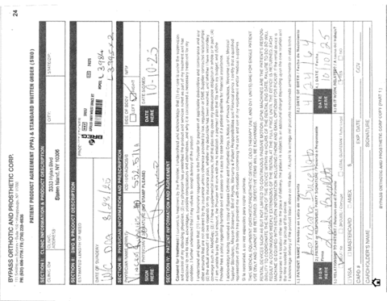
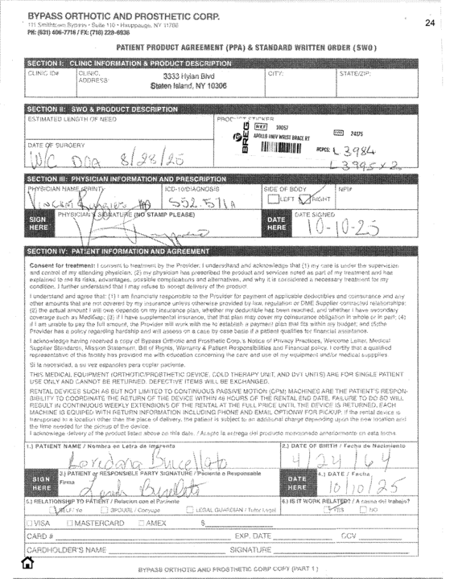

Example 2 (correct, true=180, pred=180, conf=0.9884):

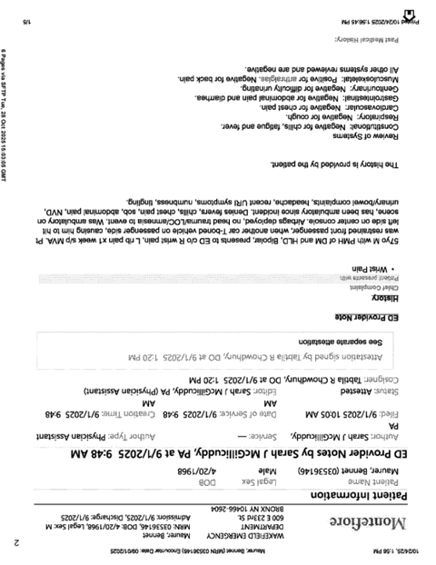
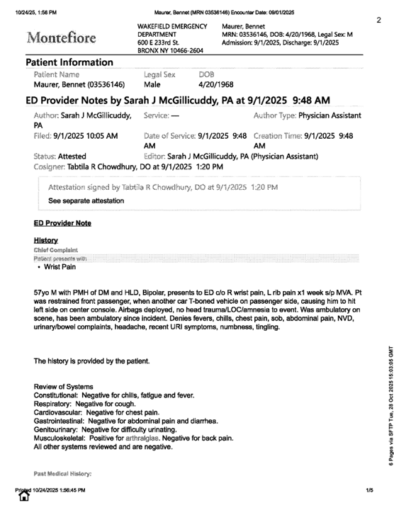

Example 3 (correct, true=270, pred=270, conf=0.9989):

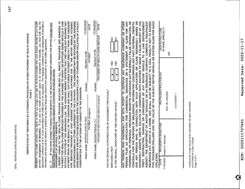
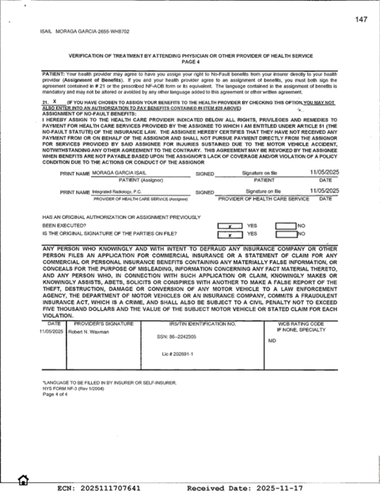

Example 4 (correct, true=90, pred=90, conf=0.9986):

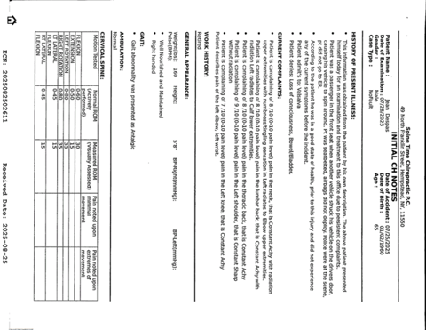
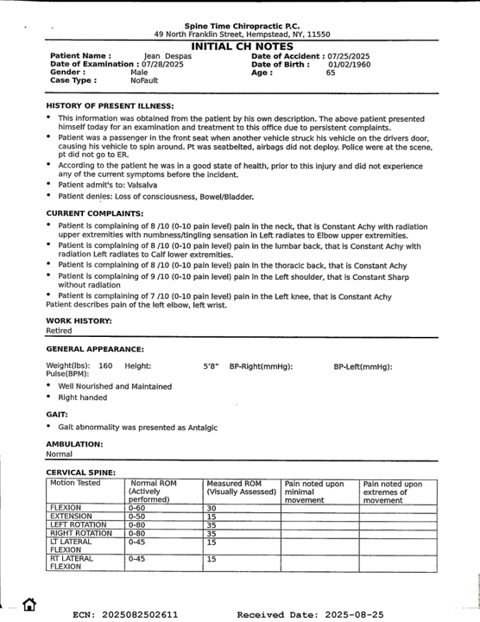

Example 5 (correct, true=270, pred=270, conf=0.9888):

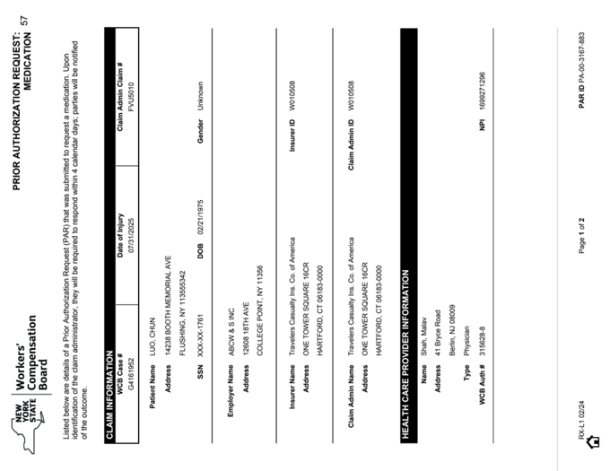
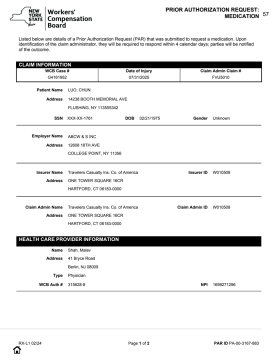

Example 6 (wrong, true=180, pred=90, conf=0.6514):

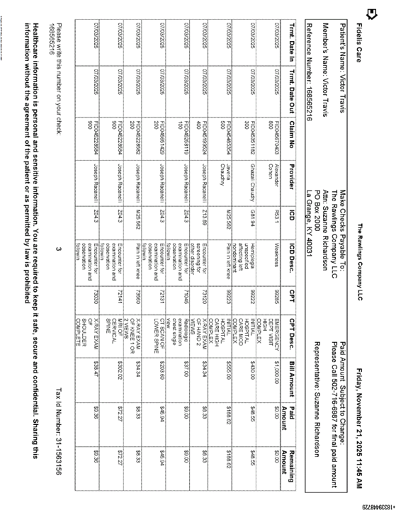
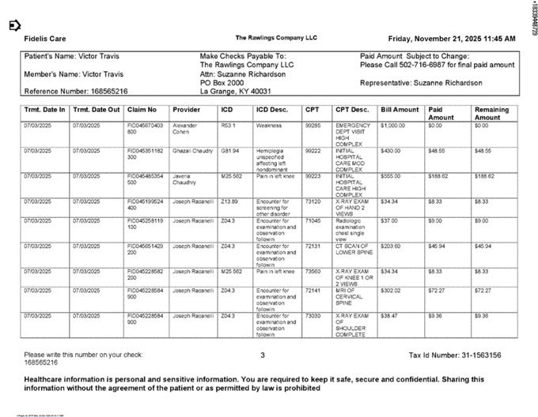
